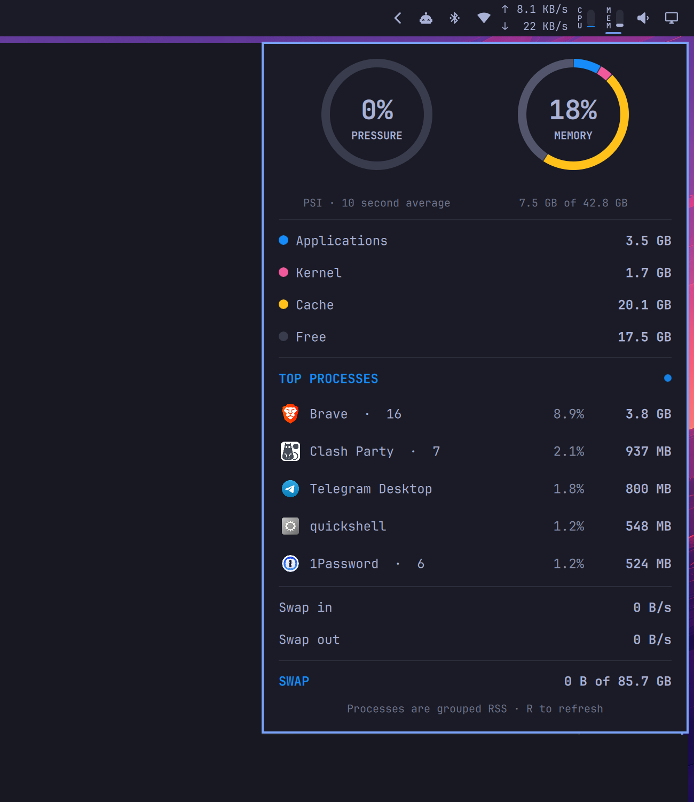

# Memory Usage for Omarchy

An iStat Menus-inspired Omarchy Quattro bar widget for live RAM usage, Linux memory pressure, memory composition, top processes, paging activity, and swap.



## Features

- Compact vertical `MEM` label and adjacent meter, centered in a standard icon slot, that fills upward with used RAM
- Native Quattro popout with pressure and memory rings
- Applications, kernel, cache, and free-memory composition
- Top processes grouped by executable name, with application icons
- Live swap-in and swap-out rates plus total swap usage
- Theme-aware panel text and native keyboard/panel switching behavior

## Install

```sh
omarchy plugin add https://github.com/egoist/omarchy-memory-usage.git --enable
```

The widget lands in the right section of the bar. Move it if needed:

```sh
omarchy bar move dev.egoist.memory-usage --section right
```

## Configure

Set the fixed horizontal widget width (default `27`, the standard icon slot):

```sh
omarchy bar set dev.egoist.memory-usage width 27
```

Set the number of process rows (default `5`, range `1–10`):

```sh
omarchy bar set dev.egoist.memory-usage processCount 5
```

## How the metrics work

Overall usage is `MemTotal - MemAvailable` from `/proc/meminfo`, matching modern Linux's view of memory that cannot be readily reclaimed. The composition ring is a complete physical-memory breakdown:

- **Applications**: anonymous pages plus shared memory
- **Kernel**: the remaining non-cache, non-free physical memory
- **Cache**: page cache plus reclaimable slab, excluding shared memory
- **Free**: completely unused physical memory

Pressure is Linux PSI's `some avg10`: the percentage of the last ten seconds during which at least one task was stalled waiting for memory. It is intentionally not derived from the usage percentage.

Process totals are resident set size (RSS), grouped by executable name. Shared pages can appear in more than one process, so process rows should not be added up to reproduce overall usage.

## Dependencies and security

The plugin runs unsandboxed with your user permissions, like every Omarchy shell plugin. It does not use `sudo`, install packages, start services, or access the network.

It reads Linux's `/proc` statistics and uses commands included with a standard Omarchy installation: Bash, `awk`, `ps`, `sort`, `head`, `getconf`, `date`, and `jq`.

## Update

```sh
omarchy plugin update dev.egoist.memory-usage
```

## Remove

```sh
omarchy plugin remove dev.egoist.memory-usage
```

## License

MIT
